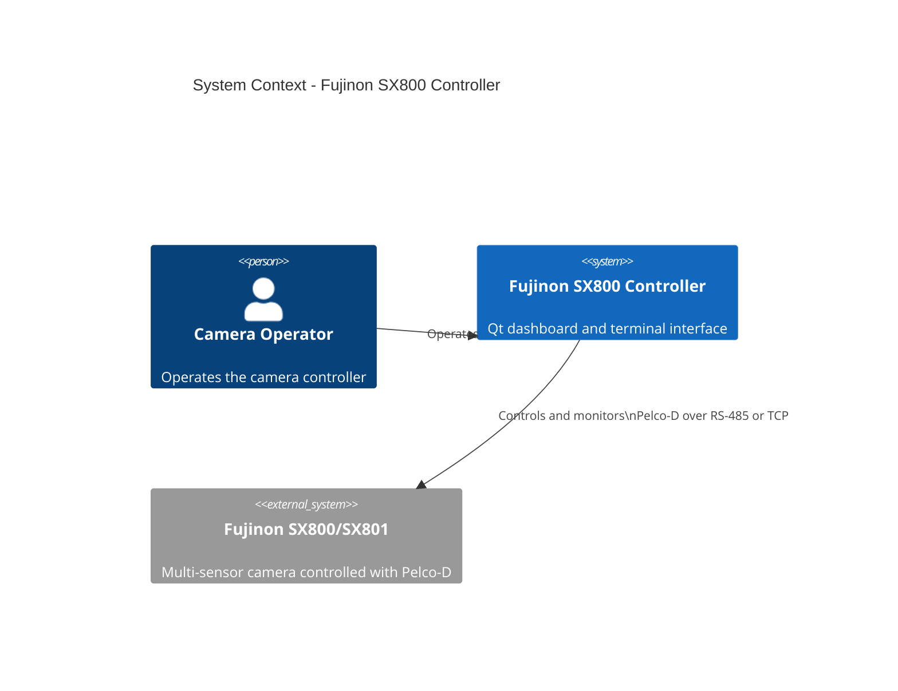
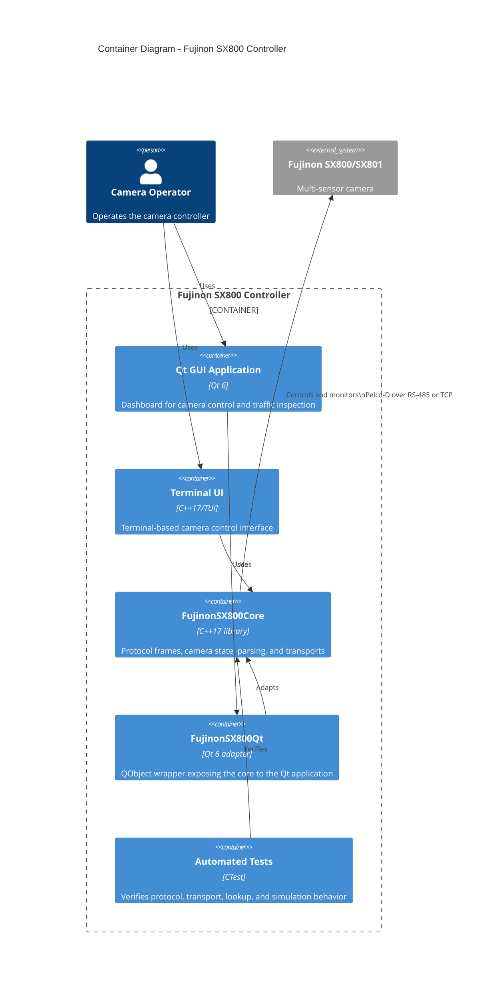
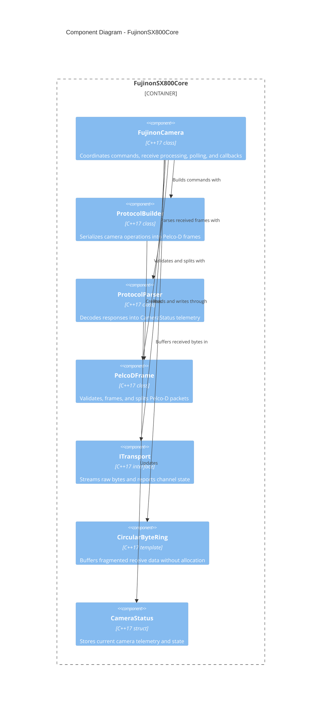
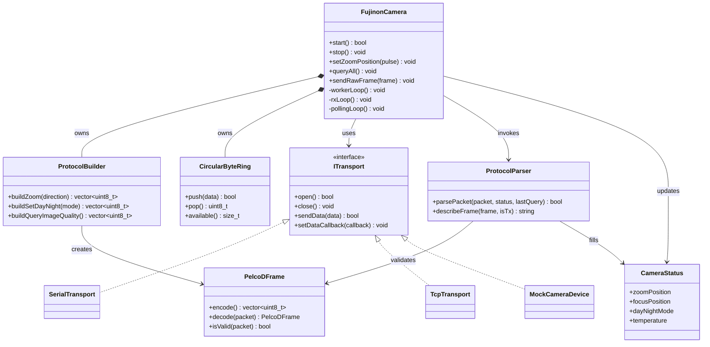

# C4 Model

The Fujinon SX800 Controller communicates with Fujinon SX800/SX801 cameras over
Pelco-D using either a serial RS-485 connection or TCP. The Qt and terminal
applications share the zero-Qt core library.

## System Context

### ASCII

```text
                                  +----------------------+
                                  | Camera Operator      |
                                  | Uses the controller  |
                                  +----------+-----------+
                                             |
                                             | operates
                                             v
                         +-------------------+-------------------+
                         | Fujinon SX800 Controller             |
                         | Qt dashboard and terminal interface  |
                         +-------------------+-------------------+
                                             |
                                             | Pelco-D over RS-485 or TCP
                                             v
                                  +----------+-----------+
                                  | Fujinon SX800/SX801  |
                                  | Multi-sensor camera  |
                                  +----------------------+
```

### Mermaid



## Containers

### ASCII

```text
+----------------------+       +---------------------------+
| Camera Operator      |       | Fujinon SX800/SX801       |
+----------+-----------+       | Multi-sensor camera       |
           |                   +-------------^-------------+
           | operates                        |
           v                                  | Pelco-D over RS-485/TCP
+----------+-----------+                      |
| Fujinon SX800        +----------------------+
| Controller            |
+----------+-----------+
           |
           | uses
           +----------------------+----------------------+
           |                     |                      |
           v                     v                      v
+----------+-----------+ +-------+----------------+ +---+----------------+
| Qt GUI application   | | Terminal UI           | | Automated tests  |
| Qt 6 dashboard       | | Terminal controller   | | Core behavior    |
+----------+-----------+ +-------+----------------+ +---+----------------+
           |                     |                      |
           | uses                | uses                 | verifies
           v                     v                      v
+----------+----------------------------------------------+
| FujinonSX800Core                                      |
| C++17 protocol, camera state, parsing, and transports |
+----------------------+--------------------------------+
                       ^
                       |
                       | adapts core API to Qt
                       |
              +--------+---------+
              | FujinonSX800Qt   |
              | Qt QObject layer |
              +------------------+
```

### Mermaid



## Components

The Component view zooms into the `FujinonSX800Core` container.

### ASCII

```text
+----------------------- FujinonSX800Core ------------------------+
|                                                                  |
|  +----------------+       +-------------------+                 |
|  | FujinonCamera  |------>| ProtocolBuilder   |                 |
|  | Controller     |       | Command serializer |                 |
|  +-------+--------+       +---------+---------+                 |
|          |                          |                            |
|          | parses                   | builds                     |
|          v                          v                            |
|  +-------+--------+       +---------+---------+                 |
|  | ProtocolParser |       | PelcoDFrame       |                 |
|  | Telemetry      |       | Framing/checksum  |                 |
|  +-------+--------+       +---------+---------+                 |
|          |                          |                            |
|          v                          v                            |
|  +-------+--------+       +---------+---------+                 |
|  | CameraStatus   |       | ITransport        |<-- Serial/TCP   |
|  | Telemetry model|       | Raw byte channel  |<-- Mock         |
|  +----------------+       +-------------------+                 |
|                                                                  |
|  CircularByteRing buffers fragmented receive data for the        |
|  controller's RX processing path.                                |
+------------------------------------------------------------------+
```

### Mermaid



## Code

The Code view shows the principal classes involved in one command and response
cycle. Mermaid uses a `classDiagram` here because it has no `C4Code` diagram
type.

### ASCII

```text
                     +----------------------+
                     | FujinonCamera        |
                     | start/stop           |
                     | command methods      |
                     | worker/rx/poll loops |
                     +----+------+------+---+
                          |      |      |
                 owns     |      |      | owns
                          |      |      v
                          |      |  +----------------+
                          |      +->| CircularByteRing|
                          |         | receive buffer |
                          |         +----------------+
                          |
              +-----------+-----------+----------------+
              |                       |                |
              v                       v                v
     +----------------+     +----------------+  +-------------+
     | ProtocolBuilder|     | ProtocolParser |  | ITransport  |
     | build commands |     | parse replies  |  | raw I/O     |
     +--------+-------+     +--------+-------+  +------+------+
              |                       |                |
              v                       v                +--+--+--+
       +--------------+       +--------------+             |  |  |
       | PelcoDFrame  |       | CameraStatus |         Serial TCP Mock
       | bytes/checks |       | telemetry    |
       +--------------+       +--------------+
```

### Mermaid


